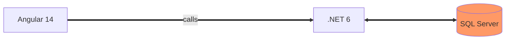
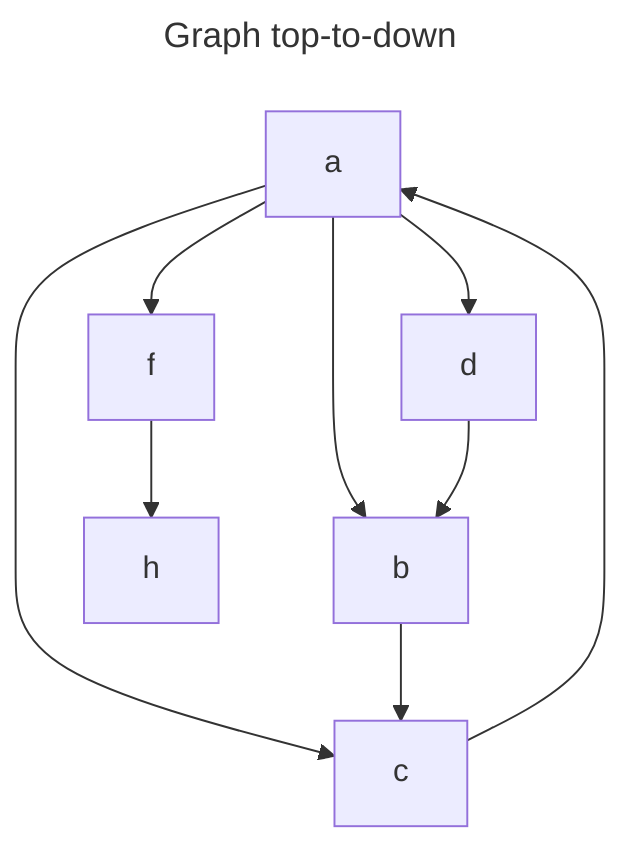
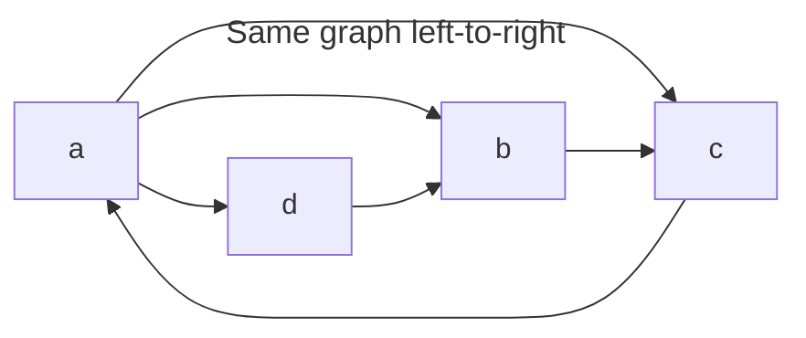
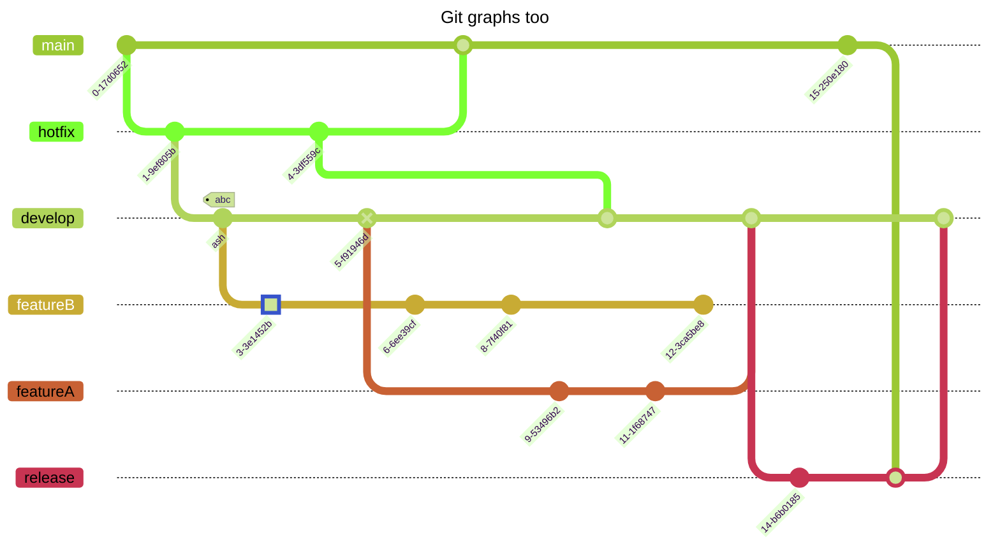

# Hello there

```mermaid
flowchart LR

  classDef orange fill:#f96

  db[(SQL Server)]
  api[.NET 6]
  client[Angular 14]

  client == calls ===========> api
  api <=====> db:::orange

  click client "https://google.com.ua" "Go to google"
  click api "./api.md"
```
__________________________

Divider 1
__________________________

```mermaid
---
title: Graph top-to-down
---
graph TD
 a --> b
 a --> c
 a --> d 

 b --> c
 c --> a
 d --> b

 f --> h

 a --> f


```
__________________________

Divider 2
__________________________

```mermaid
---
title: Same graph left-to-right
---
graph LR
 a --> b
 a --> c
 a --> d 

 b --> c
 c --> a
 d --> b
```

___________________________

```mermaid
---
title: Git graphs too
---
%%{init: { 'logLevel': 'debug', 'theme': 'forest' } }%%
      gitGraph
        commit
        branch hotfix
        checkout hotfix
        commit
        branch develop
        checkout develop
        commit id:"ash" tag:"abc"
        branch featureB
        checkout featureB
        commit type:HIGHLIGHT
        checkout main
        checkout hotfix
        commit type:NORMAL
        checkout develop
        commit type:REVERSE
        checkout featureB
        commit
        checkout main
        merge hotfix
        checkout featureB
        commit
        checkout develop
        branch featureA
        commit
        checkout develop
        merge hotfix
        checkout featureA
        commit
        checkout featureB
        commit
        checkout develop
        merge featureA
        branch release
        checkout release
        commit
        checkout main
        commit
        checkout release
        merge main
        checkout develop
        merge release
```